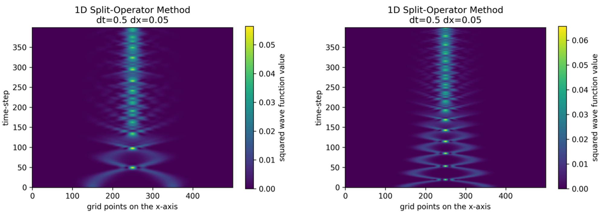
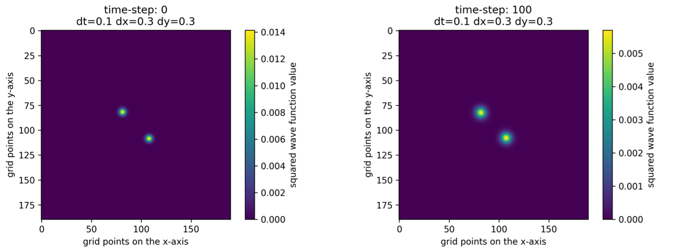
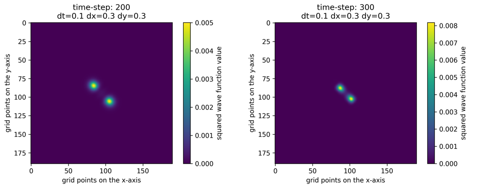
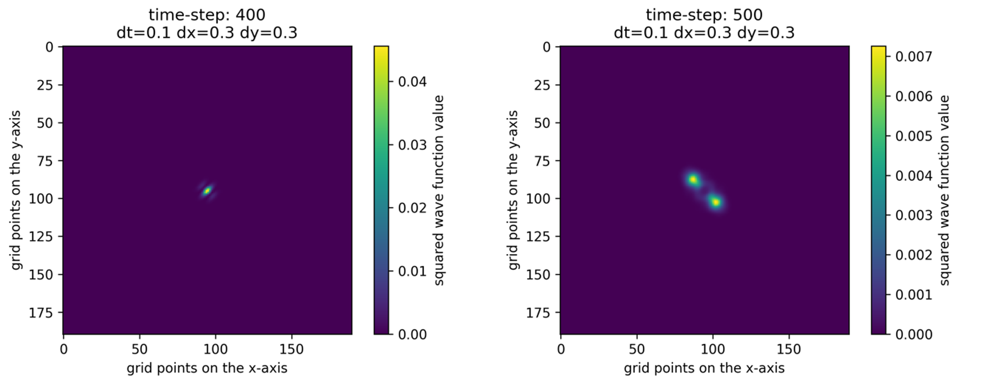

# SP_Simulator

## Numerical solution of the Schrödinger-Poisson equation 

### Schrödinger Poisson equation
The normal Schrödinger equation describes how a particle's wave function behaves with time and is given in Equation 1, where m is the mass and ℏ the reduced Planck constant. (Griffiths & Schroeter, 2018)

$$
i\hbar \frac {\partial u}{\partial t} =-\frac{\hbar^2}{2m}\frac{\partial^2u}{\partial x^2}+Vu
$$

The equation only gains physical meaning if it is squared and integrated, as shown in Equation 2. After that, it can be interpreted as a probability of finding the particle at a given point in space. (Griffiths & Schroeter, 2018)

$$
\int_{a}^{b}{\left|u(x,t)\right|^2dx}=p
$$

where $p$ is the probability of finding the particle between $a$ and $b$, at time $t$.

In general, there are three cases of this equation. The first is the free case with $V=0$; the second is the linear case is $V=V(x)$ where the potential is only dependent on space, and the non-linear case with $V=V(x,u)$ (Mauser & Stimming, 2021). Since, in the last case, the potential is also dependent on the solution, the whole equation becomes non-linear. The last non-linear case will not be discussed here. However, the written code can treat such potentials as well. 

The Schrödinger-Poisson equation modifies Equation 1 by adding a Newtonian gravitational potential. Hereby, the probability density is interpreted as a mass density. The full PDE is given in Equations 3 and 4. Such a system can also describe things like exotic dark matter. (Mocz, 2023)

$$
i\hbar\frac{\partial u}{\partial t}=-\frac{\hbar^2}{2m}\frac{\partial^2u}{\partial x^2}+Vu+m\Phi u
$$
$$
\Phi=\ \frac{1}{\nabla^2}4\pi Gm\left|u\right|^2
$$

### Scaling 

Since the focus of this project lies only on solving the system numerically, the equations will be scaled by introducing a new dimension-less parameter $\varepsilon=\frac{\hbar}{m}$ and define a new potential with $V_{new}=\ \frac{V_{old}\ }{m}$. Furthermore, for the sake of simplicity, it will be assumed that  $\varepsilon=1$ and $4\pi G=1$. The new system is shown in Equation 5 (Mauser & Stimming, 2021) and 6. 

$$
i\frac{\partial u}{\partial t}=-\frac{1}{2}\frac{\partial^2u}{\partial x^2}+Vu+\Phi u
$$
$$
\Phi=\ \frac{1}{\nabla^2}\left|u\right|^2
$$

### Split-Operator Method 

The chosen method for solving the Schrödinger-Poisson equation numerically is a so-called Split-Operator Method. At first, it will only be introduced for the scaled Schrödinger equation shown in Equation 7 (Mauser & Stimming, 2021). Later, it will be adapted to simulate the whole Schrödinger-Poisson system.

$$
i\frac{\partial u}{\partial t}=-\frac{1}{2}\frac{\partial^2u}{\partial x^2}+Vu
$$
In the first step, the Hamiltonian of the system will be split into a component in position space ${\hat{H}}_x=V$ and into a component in momentum space ${\hat{H}}_k=-\frac{1}{2}\frac{\partial^2}{\partial x^2}$. Next, a somewhat general solution to the system is assumed, displayed in Equation 8. The system is also presumed to be simulated by concatenating a series of small timesteps $∆t$. (Schloss, 2022)

$$
u(x,t+∆t)=[e^{-i\hat{H}∆t}] u\left(x,t\right)=[e^{i(\hat{H}_x+\hat{H}_k)∆t},)
$$

Using the Baker-Campbell-Housdorff theorem, this solution can be split. The thus retrieved formula is shown in Equation 9. (Schloss, 2022)

$$
u(x,t+∆t)=[e^{-i\hat{H}_x∆t}e^{-i\hat{H}_k∆t}e^{[i\hat{H}_x,i\hat{H}_k]∆t^2}]u(x,t)
$$

Since the cross-term scales with ∆t2 in contrast to ∆t, its contribution will be small and can therefore be ignored. Because of this, the overall error of this method is $Ο(∆t^{2})$ (Schloss, 2022).

Next, it can be observed that the part in the position space and the part in the momentum space can be dealt with separately. The part in position space can be calculated relatively easily since it is just a simple multiplication. The momentum space part is a bit more difficult since it contains the operator $\frac{\partial^2}{\partial x^2}$. To circumvent this problem, the Fourier Transform is used because it will change the differential operator into a simple multiplication. The process is shown in Equation 10, where k denotes the wave number according to the current position $x$ and $\mathcal{F}$ denotes the Fourier Transform. (Schloss, 2022)

$$
\frac{\partial^2u_x}{\partial x^2}=\mathcal{F}^{-1}\left[\frac{{k_x}^2}{2}\mathcal{F}\left[u_x\right]\right]
$$

Because the Fourier Transform is computationally inefficient, the Fast Fourier Transform (FFT) will be used. One complete timestep of the algorithm is displayed in Equation 11, where $\mathcal{F}$ now denotes the FFT, ${\hat{U}}_x=e^{-i\hat{H}_x∆t}$ and ${\hat{U}}_k=e^{-i\hat{H}_k∆t}$. (Schloss, 2022)

$$
u(x,t+∆t)=[\hat{U}_k(∆t)\mathcal{F}[\hat{U}_x(∆t)u(x,t)]] +O(∆t^{2})
$$

Now, the algorithm for the simulation of the Schrödinger Equation is finished and can be easily adapted. Since the Newtonian term also uses a differential operator, the FFT is used as well as shown below (Johansson, 2010)

$$
V_{int}=\frac{1}{\nabla^2}\left|u_x\right|^2=\mathcal{F}^{-1}\left[\frac{1}{{k_x}^2}\mathcal{F}\left[\left|u_x\right|^2\right]\right]
$$

Since a division by $0$ is not allowed, one must choose a sufficiently small number greater than $0$ if the wave number is $0$. The result of Equation 12 is a somewhat internal potential due to the Newtonian gravitational force. The routine in Equation 11 will basically stay the same. The only thing that changes is the operator ${\hat{H}}_x$ which now will be ${\hat{H}}_x=V+Vinit$ instead of just $V$ (Johansson, 2010).

### Simulating a 1D-Particle 

The results shown in Figure 1 are valid for a free wave and, therefore, $V=0$. Furthermore, to highlight the effect of the Newtonian gravitational potential ${\hat{H}}_x$ was slightly modified to ${\hat{H}}_x=V+ {5V}init$ and periodic boundary conditions were used. As an initial condition, two Gaussians were utilized, which were normalized so that the area below the curve equals $1$. The code can be found in this repository inside the folder "Simulation_1D".

    
    Figure 1 (left) and Figure 2 (right)

In Figure 1, the two initial Gaussian attract one another, which is precisely what was expected. After they first meet each other around time-step 50, they move past one another, and then they move away from each other. This is because the peaks gather momentum until they meet. The gathered momentum then pushes them away from each other afterward. With more and more time steps, this attraction and moving apart from one another becomes far less pronounced until they eventually form one peak in the wave. 

In the next step, the code was adapted to the linear case of the Schrödinger Equation. The momentum that was used is displayed in Equation 13. 

$$V=0.05x^2 $$

The result can be seen in Figure 2. The potential is pushing the two Gaussian peaks even stronger toward each other. Therefore, the point of the first meeting is around time step 25. Because of the potential, the frequency of the meeting points is increased, again as expected. 

### Simulating a 2D-Particle 
The code can easily be adapted from simulating a 1D particle to simulating a 2D particle in the $V=0$ case. Unfortunately, the representation of the system is a little bit harder than in the 1D case. Therefore, only a few time steps of the simulation are displayed now. Like in the 1D case ${\hat{H}}_x$ was slightly modified to ${\hat{H}}_x=V+5Vint$. As for the 1D case, periodic boundary conditions were used. The most challenging part of extending the code into the 2D case was getting the right wave number matrix. The correct calculation is shown in Equation 14. 

$$
k_{2D}=\sqrt{{k_x}^{2}+{k_y}^{2}}
$$

The results of the simulation can be shown in Figure 3. As an initial condition, two 2D Gaussians were used, which were again normalized so that the total volume was equal to $1$. The two Gaussian peaks behave as expected from the 1D case. They attract one another, and after they meet, they travel past one another. The whole code can be found in this repository inside the folder "Simulation_2D." 

    
    Figure 3 (left) and Figure 4 (right)

    
    Figure 5 (left) and Figure 6 (right)

    
    Figure 7 (left) and Figure 8 (right)

### Bibliography

- Griffiths, D. J., & Schroeter, D. F. (2018). Introduction to quantum mechanics. Second edition. Cambridge: Cambridge University Press
- Mauser, H., & Stimming, H. P. (2021). Scriptum: Nonlinear Schrödinger and Wave Equations. Vienna.
- Johansson, F. D. (2010). Simulation of the Maxwell-Dirac and Schrödinger-Poisson systems. Göteborg.
- Mocz, P. (2023, 1 25). Create Your Own Quantum Mechanics Simulation (With Python). From gitconnected: https://levelup.gitconnected.com/create-your-own-quantum-mechanics-simulation-with-python-51e215346798
- Schloss, J. (2022, 12 9). The Split-Operator Method. From algorithm-archive: https://www.algorithm-archive.org/contents/split-operator_method/split-operator_method.html

### Comments 

Sorry, but I had trouble including the numbering for the equations, so they are not included.....
